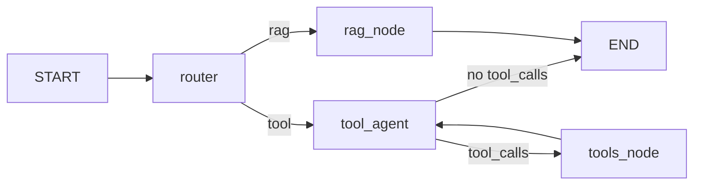
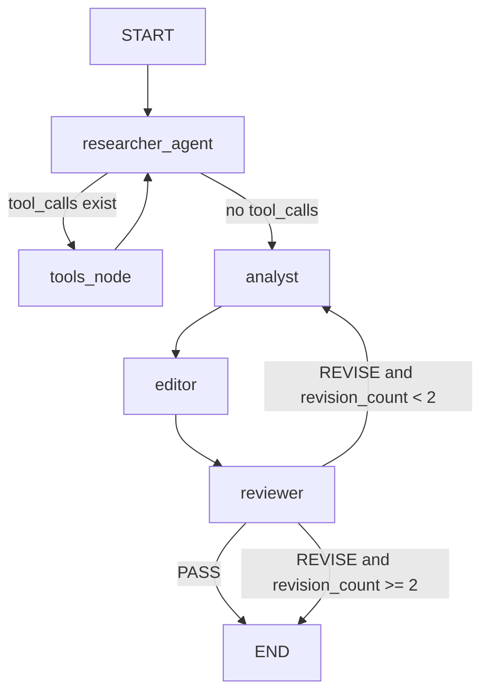

# CineMate Agent 설계 문서

팝콘 모드(빠른 Q&A)와 디렉터 모드(4-에이전트 딥 파이프라인) 두 가지 서비스 구조의 확정된 설계를 기술합니다.

---

## §1 서비스 개요: 두 가지 모드

| 모드 | 명칭 | 특성 | 진입 방식 |
|------|------|------|-----------|
| 팝콘 모드 (Popcorn Mode) | 빠른 팩트 중심 Q&A | 단일 질의 → 즉시 답변 | `CineMateAgent.run(query, mode="chat", session_id=...)` |
| 디렉터 모드 (Director Mode) | 깊이 있는 분석·통찰 | 수집 → 분석 → 편집 → 검수 파이프라인 | `CineMateAgent.run(query, mode="director", session_id=...)` |

`CineMateAgent`는 `mode` 파라미터에 따라 내부적으로 `_chat_graph` 또는 `_director_graph`를 호출하며, 외부 진입점(`AgentResponse` 반환)은 동일하게 유지됩니다.

---

## §2 팝콘 모드 — 그래프 설계

현재 구현에서 **2가지만 수정**하고 나머지 구조는 유지합니다.

### 그래프



### 현재 대비 변경점 2가지

- **ReAct 그래프화:** `tool_node` 단일 노드 → `tool_agent` + `tools_node` 두 노드 분리 + 조건부 엣지 (LangGraph 권장 패턴). 기존에는 단일 노드 안의 `for` 루프였으므로 그래프 레벨에서 ReAct가 드러나지 않았음.
- **멀티턴 실제 동작:** `state["messages"]`를 사용하지 않던 모든 노드에서 `state["messages"][-10:]`를 LLM 입력에 반영. `InMemorySaver` + `thread_id` 체크포인터는 이미 있으므로 노드 내 로직만 수정.

### State 스키마 (`graph/agent_graph.py`)

```python
class ChatState(TypedDict):
    messages:     Annotated[list, add_messages]  # 대화 이력 (add_messages reducer)
    route:        Literal["rag", "tool"]
    sources:      list[str]
    final_answer: str
    agent_used:   str
```

---

## §3 Researcher Agent와 팝콘 모드 그래프의 구조적 차이

팝콘 모드와 디렉터 모드의 Researcher Agent는 표면상 비슷해 보이지만, 설계 철학이 다릅니다.

**팝콘 모드:** `router`(분류기)가 먼저 질문을 보고 RAG 또는 Tool **둘 중 하나**를 선택합니다. 한 질문에 한 경로만 실행됩니다.

**Researcher Agent:** `router`가 없습니다. LLM 자신이 어떤 도구를 몇 번이든 자유롭게 선택하며, **RAG와 Web 검색을 동시에** 활용할 수 있습니다. 팝콘 모드에서 별개의 경로였던 `rag_node`는 `@tool rag_search`로 래핑돼 도구 하나가 되고, 기존 3개 Web 도구와 함께 하나의 ReAct 루프 안으로 들어옵니다.

| 구분 | 팝콘 모드 | Researcher Agent |
|------|-----------|-----------------|
| 노드 수 | 4개 (router, rag_node, tool_agent, tools_node) | 2개 (researcher_agent, tools_node) |
| 도구 접근 | EITHER RAG OR Tool (router가 결정) | RAG + Web 동시 접근 (LLM이 결정) |
| 도구 목록 | 경로마다 고정 | `rag_search`, `wikipedia_search`, `tavily_search`, `tmdb_search` 모두 사용 가능 |
| 출력 목적 | 사용자에게 최종 답변 | Analyst에게 넘길 원자료(raw_data) 수집 |

노드 수 자체는 팝콘 모드(4개)보다 Researcher(2개)가 오히려 적습니다. 하지만 Researcher는 **도구를 병렬·순차로 자유롭게 조합**할 수 있으므로 수집 능력은 훨씬 풍부합니다.

---

## §4 파일 구조

```
CineMate/
├── core/
│   ├── prompts.py          [수정] 팝콘 모드 프롬프트 유지 +
│   │                              RESEARCHER_PROMPT, ANALYST_PROMPT,
│   │                              EDITOR_PROMPT, REVIEWER_PROMPT 추가
│   ├── tools.py            [수정] rag_search @tool 추가
│   │                              (RAGPipeline.get_retriever 래핑)
│   └── rag_pipeline.py     [변경 없음]
│
├── graph/
│   ├── agent_graph.py      [수정] 팝콘 모드 그래프
│   │                              - tool_node → tool_agent + tools_node 분리
│   │                              - 멀티턴: state["messages"][-10:] 사용
│   │                              - CineMateAgent.run()에 mode 파라미터 추가
│   │                              - _director_graph 참조 추가
│   ├── director_graph.py   [신규] 디렉터 모드 그래프
│   │                              researcher_agent ↔ tools_node →
│   │                              analyst → editor → reviewer → (PASS|REVISE 루프)
│   └── schemas.py          [수정] DeepState TypedDict 추가
│
└── app/
    └── streamlit/
        └── main.py         [수정] 사이드바에 팝콘/디렉터 모드 선택 UI 추가
```

**신규 파일:** `graph/director_graph.py` 1개만 생성.
**수정 파일:** `core/prompts.py`, `core/tools.py`, `graph/agent_graph.py`, `graph/schemas.py`, `app/streamlit/main.py`.

---

## §5 디렉터 모드 — 그래프 설계 (`graph/director_graph.py`)

### §5.1 에이전트 역할 정의

| 에이전트 | 노드명 | 핵심 역할 | 기법 |
|----------|--------|-----------|------|
| 정보 수집가 (Researcher) | `researcher_agent` + `tools_node` | RAG·웹 검색으로 Raw Data 수집 | ReAct (researcher_agent ↔ tools_node 루프) |
| 콘텐츠 분석가 (Analyst) | `analyst` | Raw Data 기반 영화적 의미·캐릭터 심리·세계관 연결 분석 후 Draft 작성 | CoT |
| 수석 에디터 (Editor) | `editor` | Draft를 Disney 톤앤매너(따뜻·유머·웅장)로 윤문 | Few-shot |
| 검수자 (Reviewer) | `reviewer` | 톤·정확성·환각 여부 평가 → PASS / REVISE | 평가 프롬프트 |

### §5.2 State 스키마 (`graph/schemas.py`에 추가)

```python
class DeepState(TypedDict):
    messages:        Annotated[list, add_messages]  # 멀티턴 대화 이력
    query:           str
    raw_data:        str      # Researcher 수집 결과 (plain text)
    draft:           str      # Analyst 초안
    final_draft:     str      # Editor 윤문 결과
    revision_count:  int      # 무한 루프 방지 카운터 (최대 2회)
    review_feedback: str      # Reviewer 피드백 (REVISE 시)
    verdict:         Literal["PASS", "REVISE", ""]
    sources:         list[str]
    agent_used:      str      # 실행된 에이전트 이력 (콤마 구분)
```

### §5.3 그래프 흐름



조건부 엣지 `_reviewer_route(state)` 로직:

- `state["verdict"] == "PASS"` → `"end"`
- `state["verdict"] == "REVISE"` and `revision_count < 2` → `"analyst"` + `revision_count += 1`
- `state["verdict"] == "REVISE"` and `revision_count >= 2` → `"end"` (best-effort, 현재 final_draft 반환)

### §5.4 Researcher Agent — ReAct 설계

팝콘 모드의 `rag_node` 경로를 `@tool rag_search`로 래핑해 Researcher의 도구 목록에 추가합니다 (`core/tools.py`).

```python
@tool
def rag_search(query: str) -> str:
    """Search the internal ChromaDB vector store for movie scripts and plot summaries."""
    pipeline = RAGPipeline()
    docs = pipeline.get_retriever(k=4).invoke(query)
    return "\n\n".join(doc.page_content for doc in docs)

RESEARCHER_TOOLS = [rag_search, wikipedia_search, tavily_search, tmdb_search]
```

노드 동작:

- `researcher_agent`: `state["messages"][-10:]` + `RESEARCHER_SYSTEM_PROMPT` → LLM 호출. `tool_calls` 있으면 `tools_node`로 엣지.
- `tools_node`: `tool_calls` 실행 후 `ToolMessage` 반환 → 다시 `researcher_agent`로 엣지.
- 루프 종료 조건: `tool_calls` 없음 → LLM의 최종 텍스트를 `state["raw_data"]`에 저장 후 `analyst`로.

**RESEARCHER_SYSTEM_PROMPT 설계 방향:**

- 역할: 팩트 수집 전문가. **분석·해석·의견 금지**. 원본 자료(대본, 인터뷰, 메타데이터)를 최대한 수집.
- 도구 지침:
  - `rag_search`: 벡터 DB에서 영화 대본·줄거리 검색
  - `wikipedia_search`: 영화·인물 배경 및 제작 정보 검색
  - `tavily_search`: 감독 인터뷰·최신 정보·수상 내역 등 실시간 웹 검색
  - `tmdb_search`: 출연진·감독·장르·개봉일 메타데이터 조회
- 수집 완료 조건: 더 이상 도구를 쓸 필요 없을 때 수집한 모든 자료를 plain text로 출력.

### §5.5 Analyst Agent — CoT 설계

**입력:** `state["raw_data"]` + `state["query"]` + (REVISE 시) `state["review_feedback"]`
**출력:** `state["draft"]`

**ANALYST_PROMPT 설계 방향** (기존 `RAG_SYSTEM_PROMPT`의 CoT를 심화):

- ① **사실 정렬:** `raw_data`에서 직접 인용 가능한 팩트만 추출. 추측 금지.
- ② **캐릭터 심리:** Hero's Journey, 동기, 내적 갈등, 성장 아크 분석.
- ③ **세계관 연결:** 시리즈 전체 흐름·수미상관·다른 작품과의 연결 고리 발굴.
- ④ **핵심 통찰:** 위 세 단계를 종합한 하나의 날카로운 해석 제시.
- REVISE 시: `review_feedback`을 "개선 요청"으로 함께 제공하여 재작성.

### §5.6 Editor Agent — 톤앤매너 설계

**입력:** `state["draft"]`
**출력:** `state["final_draft"]`

**EDITOR_PROMPT 설계 방향:**

- 역할: 디즈니랜드 수석 스토리텔러 에디터.
- 규칙:
  - 사실·논리 변경 금지. 톤만 조정.
  - 문맥에 맞게 친근·유머·웅장 중 선택 (마블은 웅장, 픽사는 따뜻, 디즈니는 마법적).
  - 답변 말미에 "다음으로 탐험할 질문" 1개 자연스럽게 제안.
- Few-shot 예시: 분석가의 딱딱한 초안 → 에디터의 윤문 결과 비교 예시 포함.

### §5.7 Reviewer Agent — 평가 기준

**입력:** `state["final_draft"]` + `state["query"]` + `state["raw_data"]`
**출력:** `state["verdict"]` + `state["review_feedback"]`

**REVIEWER_PROMPT 설계 방향:**

체크리스트 3가지를 순서대로 평가:

1. **톤앤매너:** Disney 친화적인가? 비하·공격적 표현이 없는가?
2. **정확성:** 원래 질문에 직접 답했는가? 핵심이 빠지지 않았는가?
3. **환각 방지:** `raw_data`에 없는 사실을 단정적으로 주장하지 않았는가?

출력 형식 (파싱 용이하도록 고정):

```
VERDICT: PASS
```

또는

```
VERDICT: REVISE
FEEDBACK: <구체적 수정 요청. 예: "토니 스타크의 희생 동기를 raw_data 근거 없이 단정하고 있음. 인용 출처 명시 필요.">
```

---

## §6 멀티턴 설계 (두 모드 공통)

두 모드 모두 동일한 멀티턴 전략을 사용합니다.

| 위치 | 내용 |
|------|------|
| **invoke** | 매 턴 `messages: [HumanMessage(content=query)]`만 추가. `add_messages` + 체크포인터로 이전 턴과 자동 합쳐짐. |
| **모든 노드** | LLM 호출 시 `state["messages"][-10:]` (최근 5턴 = Human+AI 10개)만 잘라서 사용해 토큰·비용 제한. |
| **세션 관리** | `InMemorySaver` + `thread_id` 유지. `session_id`가 곧 `thread_id`. |

---

## §7 Streamlit UI Design (High-Quality Aesthetic)

`sampleUI.html`의 디자인 철학을 반영하여, Streamlit 기반임에도 사용자에게 영화적(Cinematic) 몰입감을 줄 수 있는 고품질 UI를 구현합니다.

### 7.1 시네마틱 엔트리 페이지 (Entry View)

- **모드 선택 중심:** 앱 진입 시 `Popcorn`과 `Director` 모드를 시각적으로 명확히 분리하여 선택하도록 유도.
- **Visual Cards:** 각 모드에 해당하는 아이콘(Popcorn, Clapperboard)과 함께 그라데이션 카드를 사용하여 프리미엄 느낌 부여.

### 7.2 동적 모드 테마 (Dynamic Theme)

- **Popcorn Mode:** Amber/Orange 계열의 따뜻한 톤 (`#f59e0b`).
- **Director Mode:** Indigo/Blue 계열의 깊이 있는 톤 (`#4338ca`).
- **전환 애니메이션:** 모드 전환 시 배경색 및 아이콘 테마가 즉각 선택된 모드로 동기화.

### 7.3 에이전트 프로세스 시각화 (Agent Workflow UI)

- **Collapsible Process:** 디렉터 모드 실행 시 `Researcher -> Analyst -> Reviewer -> Editor`로 이어지는 복잡한 단계를 사용자에게 투명하게 공개.
- **Status Indicator:** 각 단계의 상태(완료: ✅, 진행 중: 🔄, 개선 필요: ⚠️)를 실시간으로 표시하여 시스템의 신뢰도 향상.

### 7.4 정돈된 결과물 레이아웃 (Clean Layout)

- **Callouts:** `st.info`나 `st.status` 등을 커스텀하여 분석 결과(디렉터 심층 분석)를 강조하는 전용 레이아웃 구성.
- **Lucide Icons:** Streamlit 기본 아이콘 외에도 `lucide-icons` 스타일을 차용하여 버튼 및 섹션 헤더의 시각적 완성도 향상.


## §8 구현 우선순위

| 순서 | 작업                     | 파일                      | 내용                                                                           |
| ---- | ------------------------ | ------------------------- | ------------------------------------------------------------------------------ |
| 1    | 팝콘 모드 개선           | `graph/agent_graph.py`    | `tool_node` → `tool_agent` + `tools_node` 분리, 멀티턴 적용                    |
| 2    | rag_search 도구 래핑     | `core/tools.py`           | `RAGPipeline.get_retriever` 래핑 + `RESEARCHER_TOOLS` 목록 정의                |
| 3    | 디렉터 모드 State        | `graph/schemas.py`        | `DeepState` TypedDict 추가                                                     |
| 4    | 프롬프트 추가            | `core/prompts.py`         | `RESEARCHER_PROMPT`, `ANALYST_PROMPT`, `EDITOR_PROMPT`, `REVIEWER_PROMPT` 추가 |
| 5    | 디렉터 모드 그래프       | `graph/director_graph.py` | 4개 에이전트 노드 + REVISE 루프 신규 작성                                      |
| 6    | CineMateAgent 통합       | `graph/agent_graph.py`    | `mode` 파라미터 추가, `_director_graph` 참조                                   |
| 7    | Streamlit UI 기초        | `app/streamlit/main.py`   | 사이드바에 팝콘/디렉터 모드 선택 추가                                          |
| 8    | Streamlit UI (Aesthetic) | `app/streamlit/main.py`   | `sampleUI.html` 수준의 프리미엄 UI 디자인 적용 (§8 참고)                       |

---
